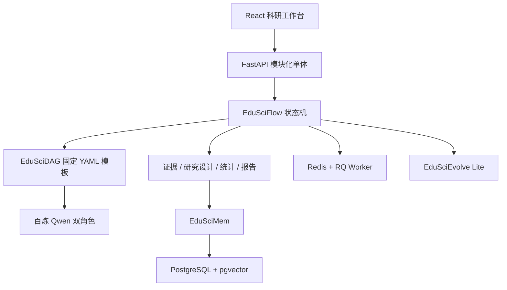

# 教育智研（EduSci）比赛 MVP

教育智研是一个面向教育学研究的模块化单体应用。它把研究想法依次转化为可追溯证据、四路径研究设计、受控统计分析、研究计划和独立复审结果。

本实现参考 AutoSci 的 SciMem、SciFlow、SciDAG 与 SciEvolve 思想，但采用适合 2–4 人比赛团队的 React + FastAPI 工程，不依赖 Claude Code 或 Markdown Wiki 外壳。

## 已实现能力

- S0–S6 显式状态机，以及 A/B/C/D 四路径和人工确认门。
- PDF 按页解析、文本分块、证据卡、内容哈希和引用门禁。
- Crossref 与 Semantic Scholar 检索适配器，外部请求最多重试三次。
- 三张固定 YAML DAG：证据构建、假设设计、最终复审。
- 阿里云百炼双角色 Qwen：生成角色与独立复审角色；结构化输出最多修复两次。
- CSV/XLSX 数据质量扫描、PII 列提示，以及 pandas/scipy/statsmodels 受控统计。
- 无真实数据时只输出预期结果，不生成伪统计结论。
- 引用、统计、逻辑、伦理 Trust Guard；未核验证据不会进入报告参考文献。
- DOCX 草稿/终稿导出；存在 BLOCK 时禁止下载终稿。
- 长任务统一返回 `202 + TaskRef`，支持 RQ、任务查询、SSE、取消和节点重试。
- EduSciEvolve Lite 只记录反馈与改进提案，不自动修改 Prompt、DAG 或安全规则。
- React + TypeScript + Ant Design 科研工作台和四个比赛演示案例。
- 一键自治研究：自动规划、多轮文献检索、官方数据发现、来源评分、检查点恢复，并只在路径、伦理/PII 和真实数据处暂停。

## 架构



主要目录：

```text
backend/edusci/
  api/            OpenAPI 路由与 Schema
  domain/         四路径和状态机
  dag/            DAG 执行器与固定模板
  memory/         SQLAlchemy 长期/项目记忆模型
  integrations/   Qwen、Crossref、Semantic Scholar
  analysis/       对象存储、数据质量与受控统计
  reporting/      DOCX 生成
  tasks/          RQ 分发与 worker job
frontend/src/     React 科研工作台
scripts/          Windows 开发、测试和演示命令
```

## 快速启动

### 方案一：Docker Compose

需要 Docker Desktop。首次运行先复制环境变量：

```powershell
Copy-Item .env.example .env
docker compose up --build
```

对应计划中的命令为：

```powershell
make dev
make test
make e2e
make demo-seed
```

前端：<http://127.0.0.1:5174>
OpenAPI：<http://127.0.0.1:8000/docs>

### 方案二：Windows 本地直跑

本机没有 Docker 或 `make` 时使用此方式。Python 需要 3.12+，Node.js 需要 20+。

```powershell
Copy-Item .env.example .env

Set-Location backend
python -m venv .venv
.\.venv\Scripts\python.exe -m pip install -e ".[dev]"
Set-Location ..\frontend
npm install
Set-Location ..

powershell -ExecutionPolicy Bypass -File scripts\dev.ps1
```

前端端口默认是 `5174`。如需切换，在仓库根目录的 `.env` 中修改：

```dotenv
WEB_PORT=5180
```

然后执行 `scripts\stop.ps1` 和 `scripts\dev.ps1` 重启；后端 CORS、Vite 与 Docker Compose 会同步使用该端口。也可只对当前 PowerShell 临时设置 `$env:WEB_PORT="5180"`。

停止服务：

```powershell
powershell -ExecutionPolicy Bypass -File scripts\stop.ps1
```

本地直跑默认使用 SQLite 和 inline 任务，便于单机调试；Docker Compose 使用 PostgreSQL、Redis 和真正的 RQ worker。对象文件始终通过 `LocalObjectStore` 接口访问，迁移阿里云时可替换为 OSS。

## 配置百炼与开放检索

编辑 `.env`：

```dotenv
DASHSCOPE_API_KEY=你的百炼_API_Key
QWEN_GENERATION_MODEL=qwen3.7-plus
QWEN_REVIEW_MODEL=qwen3.7-max
QWEN_EMBEDDING_MODEL=text-embedding-v4
QWEN_EMBEDDING_DIMENSION=1024
ENABLE_LIVE_RETRIEVAL=true
```

未配置 Key 时，系统使用确定性演示逻辑，完整流程仍可运行。开放检索关闭时，可在 S1 上传 PDF 建立证据。

### 一键自治研究

进入项目后点击“启动自动研究”。系统会按以下顺序运行：研究规划 → 多轮文献检索 → 合法开放全文解析 → 观点与反证提取 → 证据缺口迭代 → 官方数据检索 → 路径自动选择 → 报告 v3 → 独立复审。

- 系统默认自动采用确定性门禁建议；仅在许可、伦理、隐私风险或必须等待真实数据时暂停。
- A 使用通过许可、来源和 PII 检查的开放数据运行受控统计。
- B 生成问卷后等待真实回收数据；上传 CSV/XLSX 后自动恢复。
- C 只做理论证据综合，不生成统计结果。
- D 只保留探索性方向，并阻断终稿。
- 任务失败或取消后可从已完成检查点恢复，不会重复请求已经完成的检索节点。
- 新解析全文会生成 1024 维向量并进入跨项目研究记忆；召回使用中英文词法与向量 RRF 混合排序。
- 质量门禁分别显示子问题、独立来源、反证检索和原文核验覆盖；门禁未通过时只生成受限报告。

可选配置：

```dotenv
AUTONOMOUS_RESEARCH_ENABLED=true
SEMANTIC_SCHOLAR_API_KEY=
AUTONOMOUS_MAX_LITERATURE_ROUNDS=3
AUTONOMOUS_MAX_RESULTS_PER_QUERY=10
AUTONOMOUS_DOWNLOAD_LIMIT_MB=50
AUTONOMOUS_INITIAL_ROUNDS=5
AUTONOMOUS_MAX_ROUNDS=10
AUTONOMOUS_INITIAL_FULLTEXTS=20
AUTONOMOUS_MAX_FULLTEXTS=60
AUTONOMOUS_SOFT_TIMEOUT_MINUTES=60
AUTONOMOUS_HARD_TIMEOUT_MINUTES=120
```

真实 `DASHSCOPE_API_KEY` 只能写入本地 `.env`，不要写入 `.env.example` 或提交到 Git。

## 测试

Windows：

```powershell
powershell -ExecutionPolicy Bypass -File scripts\test.ps1
powershell -ExecutionPolicy Bypass -File scripts\e2e.ps1
powershell -ExecutionPolicy Bypass -File scripts\demo-seed.ps1
powershell -ExecutionPolicy Bypass -File scripts\eval-quality.ps1 -Mode Offline
```

- `test.ps1`：凭据扫描、后端单元/API/工作流测试、24 案例离线质量评测、前端组件测试和生产构建。
- `e2e.ps1`：A/B/C/D 四条路径从 Idea 运行到报告复审终点，并用真实 Chromium 验收首页、创建项目和 S1 工作台。
- `demo-seed.ps1`：写入四个离线演示项目并推进到路径确认页；演示来源是测试夹具，不应用于正式研究结论。
- `eval-quality.ps1 -Mode Offline`：使用固定快照运行 `research-quality-v1`，不访问网络、不消耗 Token。
- `eval-quality.ps1 -Mode LiveQwen`：使用 `.env` 中的百炼配置运行 24 案例真实模型评测，结果写入 `artifacts/quality-report.json`。

## 使用顺序

1. 在首页创建项目并输入 Idea。
2. 解析研究问题，在 S1 上传 PDF 或运行开放检索。
3. 查看证据卡与 Trust 状态，运行信息充足度/可研究性评分。
4. 人工确认 A/B/C/D 路径。
5. 生成研究设计；B 路径会生成问卷并等待真实回传数据。
6. A/B 路径上传 CSV/XLSX，填写结果变量和分组变量后运行受控分析。
7. 生成研究计划并执行引用、统计、逻辑、伦理复审。
8. PASS/WARN 可下载终稿；BLOCK 只能下载带风险说明的草稿。

上传限制：仅 PDF/CSV/XLSX，单文件最大 50 MB。涉及真实学生数据时，仍须由研究团队完成脱敏、知情同意和伦理审批。

## API 入口

- 项目：`/api/v1/projects`
- Idea/证据/门控/研究设计：`/api/v1/projects/{id}/*-runs`
- PDF 与证据：`/api/v1/projects/{id}/documents`、`/evidence`
- 数据与分析：`/api/v1/projects/{id}/datasets`、`/analysis-runs`
- 报告与复审：`/report-runs`、`/review-runs`、`/report.docx`
- 报告 V2：`/report-regenerations` 重新生成，`/report-artifacts` 查看历史版本；下载接口可传 `artifact_id` 和 `mode=draft|final`
- 数据来源声明：`PUT /api/v1/datasets/{id}/provenance`，`unknown` 数据必须人工确认，模拟数据不得作为实证 Source
- 任务：`/api/v1/tasks/{id}`、`/events`、`/cancel`、`/retry`
- 自治研究：`/api/v1/projects/{id}/autonomous-runs`、`/api/v1/autonomous-runs/{id}`、`/events`、`/cancel`、`/resume`、`/dataset-candidates`、`/research-state`、`/evidence-graph`
- 反馈提案：`/api/v1/projects/{id}/feedback-signals`

OpenAPI 是前后端唯一接口契约，运行后可在 `/docs` 直接试调。

旧项目进入报告页后点击“重新生成 V2”即可保留原报告并创建新版。V2 会分开展示真实/公开 Source、模拟输入与待采集 Target；复审为 WARN 时导出文件标记为“条件版”，BLOCK 时只能导出草稿。

## 当前 MVP 边界

- 单用户项目制，无注册登录；表中已预留 `owner_id`。
- 问卷只生成和展示，不内置发放、回收与受试者管理。
- 不执行模型生成代码，不允许自动修改 Prompt、DAG 或安全规则。
- PostgreSQL 启动时会启用 `vector` 扩展，研究全文片段按内容哈希缓存 1024 维 Embedding；SQLite 使用相同契约和内存余弦回退。
- `research-quality-v1` 当前为 24 个中英双语草案案例，先执行引用、受限报告和反证检索等结构门禁；人工批准标签后再启用完整分数门禁。
- 当前为比赛 MVP；生产部署前还需补充认证、配额、审计留存和密钥托管。
