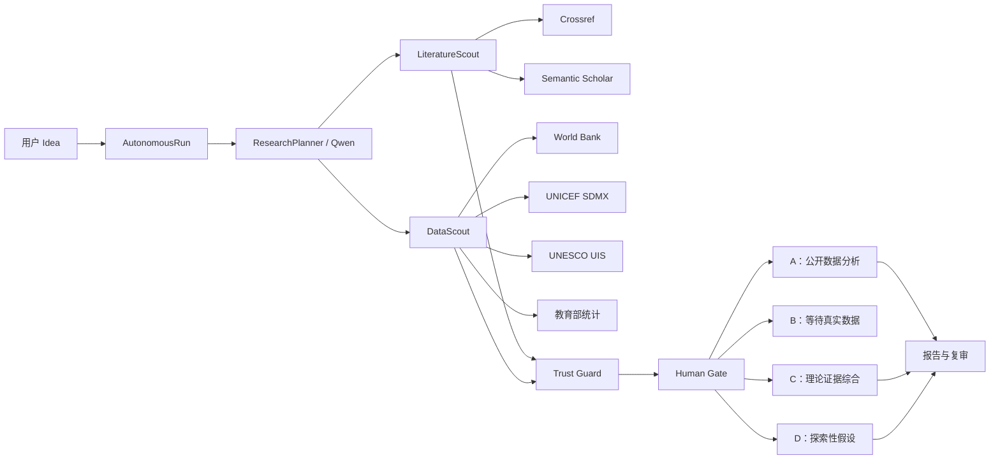

# 教育智研受控全自动研究流程设计

**日期：** 2026-07-01  
**状态：** 用户已确认  
**自动化模式：** A——一键自动执行，在路径确认、伦理风险和真实数据等待处暂停

## 1. 目标

把现有需要逐阶段点击的 S0–S6 流程升级为一个可恢复的 `AutonomousRun`。用户输入研究 Idea 后，系统自动完成研究规划、文献检索、公开数据发现、证据校验、路径评分、研究设计、受控分析、报告生成和独立复审。

系统保持三条不可越过的人工门禁：

1. 路径 A/B/C/D 必须由研究者确认。
2. 发现伦理、隐私或数据许可风险时必须暂停。
3. 路径 B 没有真实调查/实验数据时必须等待上传，不生成统计结论。

## 2. 非目标

- 不执行模型生成的 Python、SQL 或 Shell 代码。
- 不绕过登录、付费墙、验证码、robots 限制或反爬机制。
- 不自动发放问卷或生成虚假答卷。
- 不把检索摘要冒充论文全文。
- 不允许 Agent 自动修改 Prompt、DAG、Trust Guard 或安全配置。

## 3. 方案选择

采用“受控 Agent + 确定性执行器”。Qwen 只产生结构化的 `ResearchPlan`、`SearchPlan`、`DataPlan` 和 `AnalysisPlan`；后端验证 Schema 后，将计划映射到白名单适配器和受控统计函数。

未采用纯固定流水线，因为它无法根据研究主题扩展关键词、补充证据和选择数据指标。未采用开放式工具调用 Agent，因为它难以保证终止、幂等、来源许可和统计安全。

## 4. 总体架构



### 4.1 组件边界

- `AutonomousOrchestrator`：推进状态、写检查点、处理暂停/恢复，不实现检索或统计细节。
- `ResearchPlanner`：把 Idea 转为结构化研究问题、中英文关键词、变量同义词、目标地区、时间范围和数据需求。
- `LiteratureScout`：执行多轮文献发现、去重、引用扩展、重排和证据卡转换。
- `DataScout`：发现官方数据目录、生成候选、验证许可和元数据、下载可用数据资产。
- `SourceAdapter`：每个外部来源一个适配器，统一返回标准模型，不向编排器泄漏来源私有格式。
- `TrustGuard`：验证引用、来源、许可、Schema、PII、单位、时间范围和变量映射。
- `AnalysisPlanner`：仅选择允许的统计方法与字段映射。
- `ControlledAnalysisEngine`：调用现有 pandas/scipy/statsmodels 白名单函数。
- `CheckpointStore`：按节点输入哈希保存输出，提供幂等复用和取消后恢复。

## 5. 自动运行状态

`AutonomousRun` 使用以下状态：

```text
queued
planning
searching_literature
searching_datasets
ranking_sources
validating_evidence
awaiting_route_confirmation
designing_study
downloading_dataset
analyzing
generating_report
reviewing
awaiting_real_data
paused_risk
failed
canceled
completed
```

状态只由编排器写入。项目原有 S0–S6 状态继续作为业务阶段快照，保证现有页面和接口兼容。

## 6. 研究规划

`ResearchPlanner` 输出：

```json
{
  "problem_statement": "研究问题",
  "concepts": ["核心概念"],
  "variables": [{"name": "变量", "aliases_zh": [], "aliases_en": []}],
  "population": "研究对象",
  "geographies": ["CHN"],
  "time_range": {"start": 2015, "end": 2026},
  "literature_queries": [{"query": "关键词", "language": "zh|en", "purpose": "范围"}],
  "data_requirements": [{"concept": "指标概念", "unit_hint": "单位", "required": true}]
}
```

结构化输出最多修复两次。仍无法通过 Schema 时，自动任务进入 `failed`，允许从 planning 节点重试。

## 7. 文献自动检索

### 7.1 检索轮次

最多三轮，每轮有明确目的：

1. 广泛检索：研究主题、中英文核心变量和目标人群。
2. 缺口补充：根据证据覆盖矩阵补充缺少的变量关系、量表、方法和反例。
3. 引用扩展：围绕高相关种子论文获取引用/参考文献和相似论文。

停止条件满足任一项即结束：

- 已获得至少 6 条 PASS 证据，覆盖理论、测量、方法和反例中的至少 3 类。
- 三轮全部完成。
- 连续两轮没有新增 PASS 证据。

### 7.2 来源与排序

- Crossref：元数据、DOI、摘要、许可和出版信息。
- Semantic Scholar：论文、引用关系、相似论文、引用次数和研究领域。

按 DOI 优先去重；无 DOI 时使用标准化标题与年份，最后使用内容哈希。排序分数由主题相关性 45%、来源完整性 20%、可追溯性 20%、时效性 10%、证据多样性 5% 构成。引用次数只作为辅助信号，不直接代表可信度。

只有来源 API 实际返回且具备可定位标识的条目可标记为 `verified`。无摘要的条目可以作为候选文献，但不能直接生成事实性 EvidenceCard。

## 8. 公开数据自动发现

### 8.1 白名单来源

- World Bank Indicators API：人口、教育投入和宏观教育指标。
- UNICEF SDMX：教育可及性、完成率、学习和儿童相关指标。
- UNESCO UIS Data API/批量下载：跨国教育、SDG 4、教师和教育参与指标。
- 教育部统计页面：全国和各地教育事业统计表。适配器保留原始页面 URL、标题、抓取时间和响应哈希。

不把通用网页搜索结果直接当作可分析数据集。非白名单来源只生成待人工审阅候选。

### 8.2 数据候选评分

每个 `DatasetCandidate` 保存：来源、数据集/指标 ID、地区、年份、单位、频率、许可证、下载地址、字段预览、变量映射和质量分数。

选择分数由变量覆盖 35%、地区/时间覆盖 25%、官方来源 15%、字段与单位完整性 15%、缺失率预估 10% 构成。只有许可证允许、下载小于 50 MB、变量覆盖达到 70 且来源可追溯的候选可以自动选择。

若没有可用公开数据，不建议 A；可研究性高时建议 B。找到候选但下载或质量检查失败时，保留候选与失败原因并重新计算路径建议。

## 9. 路径与恢复

系统在文献和数据探索完成后计算：

- 信息充足度：PASS 证据数量、类型覆盖、来源多样性和冲突情况。
- 可研究性：变量可操作化、伦理风险、方法可行性和数据可用性。

进入 `awaiting_route_confirmation` 后停止。用户使用现有路径确认接口确认后，`AutonomousRun` 自动恢复：

- A：下载最佳数据资产，字段映射、质量检查、受控分析、报告、复审。
- B：生成问卷/实验设计，进入 `awaiting_real_data`；上传真实数据后自动恢复分析。
- C：执行概念辨析、理论综合、冲突证据和问题重构，然后报告、复审。
- D：只生成探索性假设、证伪条件和后续验证方向，然后报告、复审。

## 10. 检查点、失败和取消

每个节点记录输入哈希、输出 JSON、来源列表、开始/结束时间、尝试次数和错误。相同输入哈希直接复用完成输出。

- 429、5xx 和网络错误：指数退避，最多三次。
- 单个适配器失败：记录降级事件并继续其他来源。
- 所有文献来源失败：任务失败，不生成无来源报告。
- 数据适配器全部失败：允许继续证据评分，但不能建议 A。
- 数据质量、PII 或许可失败：进入 `paused_risk`，等待人工处理。
- 取消：当前安全边界结束后停止，保留最后完成检查点。
- 恢复：从第一个未完成或输入哈希变化的节点继续。

## 11. 数据模型

新增：

- `AutonomousRun`：项目、当前节点、状态、配置、暂停原因和最终任务 ID。
- `ResearchPlanRecord`：版本化的结构化规划与 Schema 校验结果。
- `SearchAttempt`：查询、来源、轮次、结果数、耗时和错误。
- `DatasetCandidate`：标准化数据目录候选与评分。
- `DatasetAsset`：已下载对象、内容哈希、Schema、许可和质量报告。
- `ProvenanceRecord`：实体级来源、提取时间、定位信息和转换链。
- `NodeCheckpoint`：节点输入哈希、输出和执行状态。

现有 `EvidenceCard`、`DatasetRecord`、`TaskRecord` 和 `FlowEvent` 继续使用，并通过项目或自动运行 ID 关联。

## 12. API 与事件

新增接口：

```text
POST /api/v1/projects/{project_id}/autonomous-runs
GET  /api/v1/autonomous-runs/{run_id}
GET  /api/v1/autonomous-runs/{run_id}/events
POST /api/v1/autonomous-runs/{run_id}/cancel
POST /api/v1/autonomous-runs/{run_id}/resume
GET  /api/v1/projects/{project_id}/dataset-candidates
```

启动返回 `202` 和 `{task_id, run_id, status}`。SSE 事件名称与第 5 节状态一致，payload 至少包含 `run_id、node、message、progress、timestamp`。现有路径确认和数据上传接口成功后，若项目存在暂停的自动运行，则触发恢复。

## 13. 前端表现

项目工作台增加“启动自动研究”主按钮和节点时间线。运行中显示检索轮次、文献数量、PASS 证据数量、数据候选、降级来源和暂停原因。

证据抽屉增加检索词、来源数据库、DOI、作者、年份、相关性分数和排除原因。数据候选区域展示来源、许可、地区/时间覆盖、字段、单位、变量映射、质量分数和自动选择原因。

路径门控页面保持现有视觉结构。用户确认后页面自动进入后续运行状态，不要求继续逐阶段点击。

## 14. 安全与信任

- 只执行注册的来源适配器与统计函数。
- 自动下载只接受 HTTPS、白名单域名和允许的 MIME 类型。
- 最终报告只引用 PASS EvidenceCard。
- 报告中的数据结果必须关联 `DatasetAsset`、内容哈希和 AnalysisRun。
- 没有真实或官方公开数据时，结果类型必须为 `expected_only`。
- PII 检测命中时禁止分析。
- 报告列出来源 URL、提取时间、数据版本、字段映射和处理步骤。

## 15. 测试与验收

单元测试覆盖查询扩展、去重、重排、候选评分、白名单下载、检查点幂等和路径计算。适配器测试使用录制/模拟的官方响应，不依赖实时网络。契约测试验证 Qwen Schema、API 202、SSE、取消和恢复。

端到端验收：

1. “人口变化对基础教育资源配置的影响”自动发现文献和官方人口/教育数据，建议 A；确认后完成受控分析和可追溯报告。
2. “大学生 AI 焦虑与专业关系”自动发现文献和量表线索，但没有真实调查数据时建议 B；生成问卷并停在 `awaiting_real_data`。
3. 理论研究进入 C，输出证据综合而不生成统计结果。
4. 低可研究性问题进入 D，只输出探索方向。
5. 任一检索源失败时降级继续；所有文献源失败时明确失败。
6. 取消后从最后检查点恢复，已完成节点不重复调用外部 API。
7. 最终报告每个事实和数据均可追溯。
8. inline 与 Redis/RQ 两种任务模式行为一致。

## 16. 外部接口依据

- Crossref REST API：<https://www.crossref.org/documentation/retrieve-metadata/rest-api/>
- Semantic Scholar Academic Graph API：<https://api.semanticscholar.org/api-docs/graph>
- World Bank Indicators API：<https://datahelpdesk.worldbank.org/knowledgebase/articles/889392>
- UNICEF SDMX API：<https://data.unicef.org/sdmx-api-documentation/>
- UNESCO UIS Data Browser Resources：<https://databrowser.uis.unesco.org/resources>
- 教育部教育统计数据：<https://www.moe.gov.cn/jyb_sjzl/moe_560/2024/index.html>
